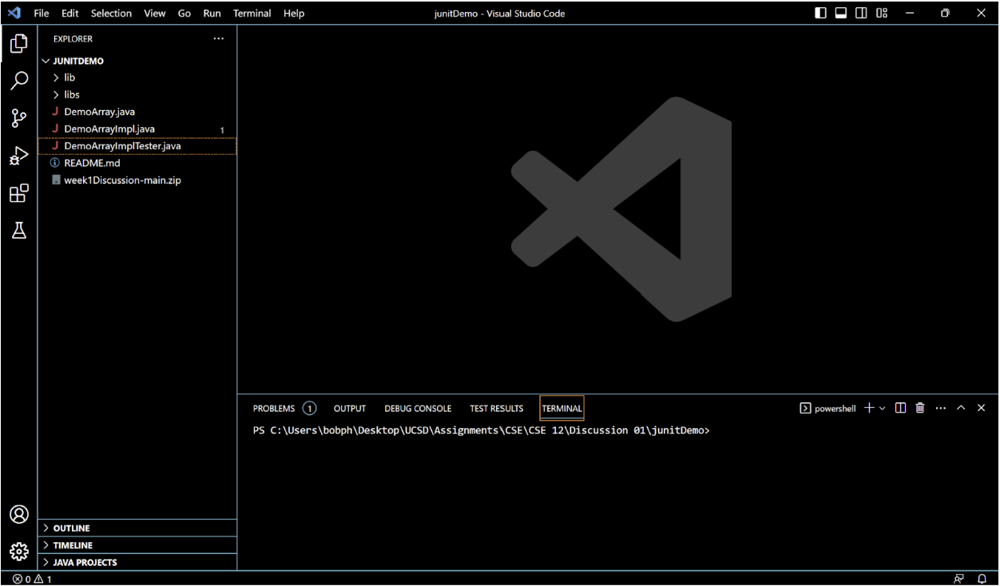
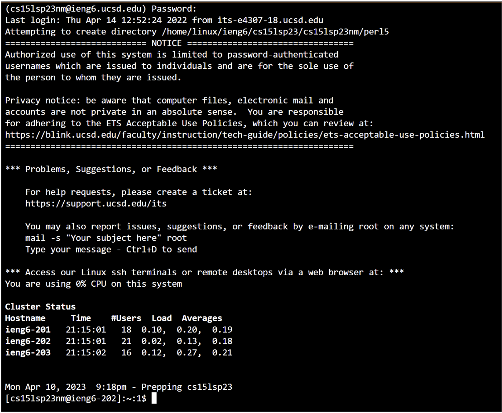
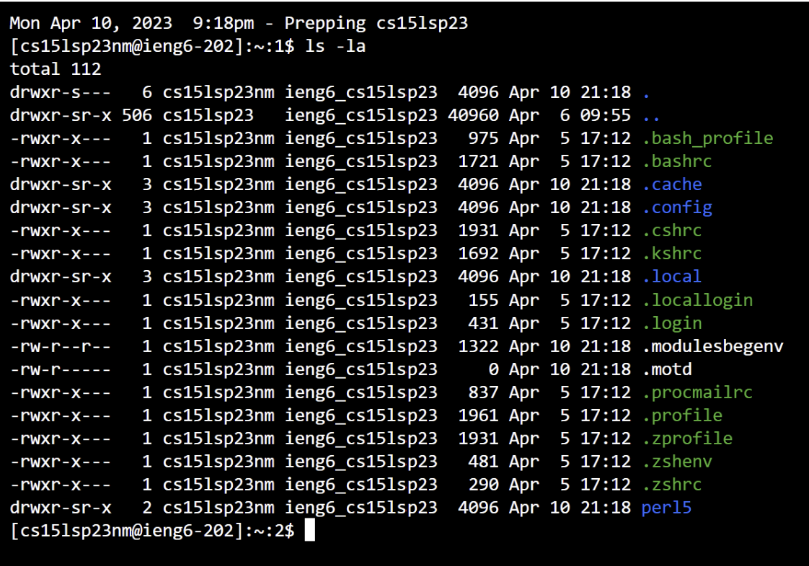

Lab 1
=====
## Logging in

To log into your account, you first need to find you account details. You can find these by looking up your course specific count here with your user ID and password: [UCSD ETS](https://sdacs.ucsd.edu/~icc/index.php).
Note: You may need to reset your account password to get access.

Next you'll want to download Visual Studio Code. You'll want to download Visual Studio Code from their website at [Visual Studio Code](https://code.visualstudio.com/). From there, you can choose your operating system and directly download the installation. 
Once you have it downloaded it should look like this:

Once you have Visual Studio Code, you'll want to download a Git Bash extension from the extensions store. After it is downloaded, you can log in by first starting a new Git Bash shell and typing in: "cs15lsp23xx@ieng6.ucsd.edu", where xx represents your two specific characters that are part of your specific ieng6 username, and hitting "enter". Afterwards, it'll prompt you for a password. Type in your password. It's fine if no letters show up. That's normal. After logging in, it'll prompt you with a question confirming your access to the account. Hit "Y". Then you'll be greeted with this screen:

## Try out some commands!
Now we can try some commands to navigate through this shell. Here is a demonstration of the command `-ls la` which shows all the directories present in your current directory, as well as the various access levels of each one.

Thank you for coming to my TED talk.
