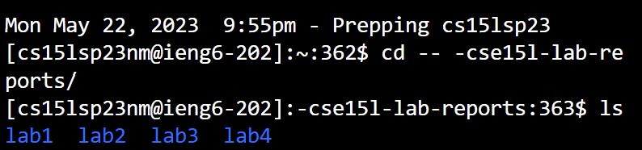
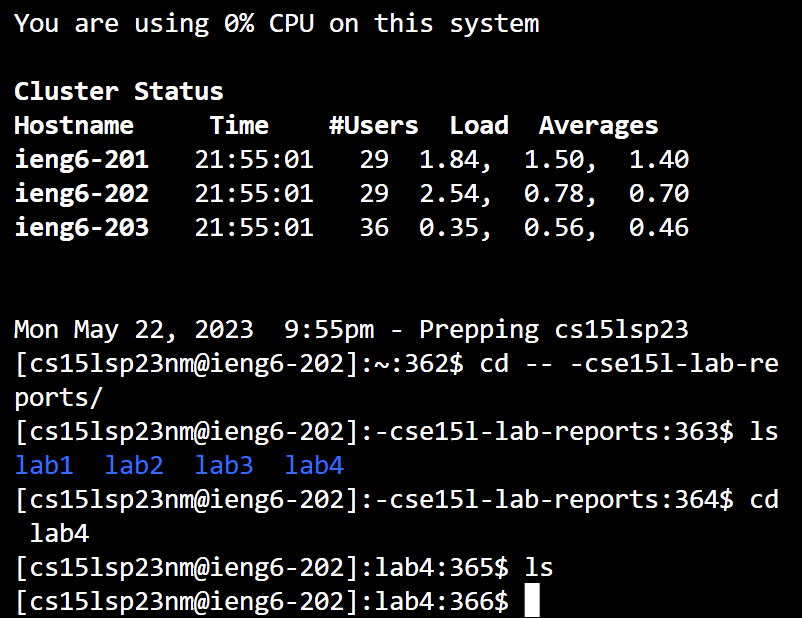

Lab 4
=====

## 
Keys Pressed:
```ssh cs15lsp23nm@ieng6.ucsd.edu<enter>``` 

Because I am doing this on a fresh shell, commands were not available from previous attempts.

Keys Pressed:
```cd -- -cs<tab><enter>ls```

The directory holding my lab stuff is in -cs15l-lab-reports, which can be gotten too more quickly with ```<tab>```.

Keys Pressed:
```cd lab4<enter>ls```
